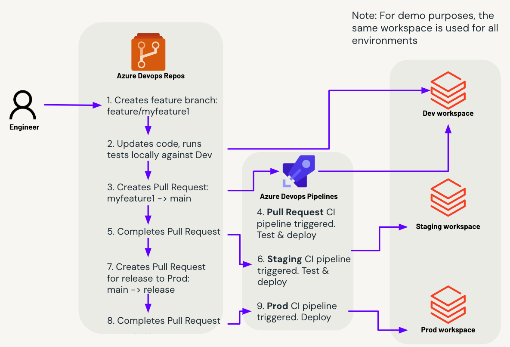

# bundle-examples

This repository provides Databricks Asset Bundles examples, with added CI/CD pipelines using Azure Devops

To learn more, see:
* The public preview announcement at 
https://www.databricks.com/blog/announcing-public-preview-databricks-asset-bundles-apply-software-development-best-practices
* The docs at https://docs.databricks.com/dev-tools/bundles/index.html

## CI/CD Process flow:

[Source Diagram](https://docs.google.com/presentation/d/1GkZlCJDqqqaeZYFR60Df3uZkdkjIegQgQNAztBEInk8/edit?usp=sharing)

CI pipeline definitions are in: `default_python/azure_devops_pipelines/`

Description:
1. Engineer create a new branch using their IDE of choice, or the Databricks Repos UI
2. Engineer makes code changes, runs unit tests locally and integration tests against the dev workspace
3. Once the feature is complete, the engineer creates a Pull Request in Azure Devops Repos
4. Azure Devops Pipelines automatically triggers a run of the Pull Requests CI pipeline. This runs tests and deploys the Databricks Asset Bundle (DAB) to the development environment
5. Once all automated checks have been completed and pull request has been approved, the engineer completes the pull request to merge the code into the main branch
6. Azure Devops Pipelines automatically triggers a run of the Main CI pipeline. This tests the code again, but against the Staging environment, which likely has more realistic production data and config. It deploys the DAB to the environment
7. (Optional) The engineer wants to release the code to the production environment, so creates a new Pull Request to merge all the code from the main branch into the release branch
8. Once the Pull Request has been reviewed, it is completed and the code is merged into the release branch
9. Azure Devopis Pipelines automatically triggers the Prod CI pipeline, deploying the DAB to production, this typically includes a scheduled trigger for the job to run at a given time